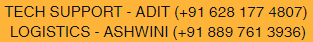
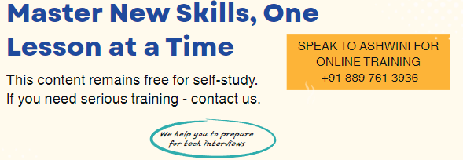

# 10-Week DSA Cohort Roadmap in C++

Welcome to the 10-Week DSA Mastery Cohort! This will build a strong foundation in Data Structures and Algorithms (DSA) using C++. At the end of the course, you should be 10x confident on your skills for coding interviews. 

This course is offered in two modes

|   | Cohort Mode (FREE)  | Classroom Mode (Fee based)  |
|---|---|---|
| Course Content | Access to full course content | Access to full course content |
| Course Delivery | Self study mode | You attend Online Classes to accelerate your learning |
| Effectiveness  | Depends on your seriousness | Acitve follow-up from mentor |
| Support & Mentoring  | Basic support | Priority support |
| Payment | ZERO | Minimal, please check with course coodinator |

### Overview of this program:

- Goal: Master DSA in C++ for coding interviews.
- Approach: Start with C++ revision (Week 0), master STL (Week 1), then build strong DSA foundation (Weeks 2–9), and demonstrate your skills in mock interviews (Week 10).

### Approach
- This is a cohort based model of learning. You will join the cohort and learn with others. 
- There would be online sessions 2-3 times (of 1-1.5 hrs) per week discussing conceptual explanations with real-world examples and C++ programs.
- You will then practice 10-15 homework programs of increasing difficulty on the topics discussed on daily basis. 
- You will slowly start practicing LeetCode/NeetCode problems every week, focusing on easy-to-medium difficulty initially.
- Weekly fun project: At the end of the week, you will develop a mini-project to apply what you've learned, showcasing your understanding (e.g., via GitHub submission). 
- You will form a group, work on project and present it to rest of the cohort members.

## Before we start
- You should have a local environement run Cpp programs. If not, reachout to tech coodinator for help (details below) if you need help.  
- You have a github account to showcase your progress. If not, reachout to tech coodinator for help.

## Coordinators
Once you join the cohort, you will be invited to cohort WhatsApp group where you can seek help from our coordinators 

  

## Roadmap
| Week | Coverage | Project | Link |
|---|---|---|---|
| Week 0 | Revising C++ Fundamentals | A Student Database | [Link](week0/README.md) |
| Week 1 | Mastering C++ STL | Phonebook Manager | [Link](week1/README.md) |
| Week 2 | Arrays and Two-Pointer Techniques | Inventory System | | 
| Week 3 | Linked Lists | Playlist Manager | | 
| Week 4 | Stacks and Queues | Browser Navigation | | 
| Week 5 | Trees and Binary Trees | Directory Explorer | |
| Week 6 | Binary Search Trees and Heaps | Task Prioritizer | | 
| Week 7 | Graphs | Network Analyzer | |
| Week 8 | Sorting and Searching | Search Engine | | 
| Week 9 | Dynamic Programming | Game Score Maximizer | |
| Week 10 | Synthesis and Mock Interviews (For paid members) | Route Planner | |

  

