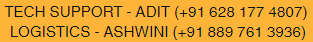

  

# Week 1 Roadmap: Mastering C++ STL for DSA Preparation

This roadmap outlines a 10-hour plan for Week 1, designed to help students master the C++ Standard Template Library (STL) in preparation for Data Structures and Algorithms (DSA). Each hour focuses on specific STL components, using real-world analogies and fully commented programs to simplify concepts. The final hours include interview practice and a mini-project to consolidate learning. The plan assumes no prior knowledge and emphasizes hands-on practice with homework and LeetCode/NeetCode problems.

| Part | Read | Practice | Attempt | Master the topic | Samples from Leetcode |
|---|---|---|---|---|---|
| 1 | [Introduction to C++ STL and Vectors](materials/1_1.md) | [home work](materials/1_2.md) -> [solutions](materials/1_3.md)|[quiz](materials/1_4.md)|[Deepdive](materials/1_5.md)| [Example](materials/1_6.md), [Additional](materials/1_7.md) |
| 2 | [Arrays and Deques in STL](materials/2_1.md) | [home work](materials/2_2.md) -> [solutions](materials/2_3.md)|[quiz](materials/2_4.md)|[Deepdive](materials/2_5.md)| [Example](materials/2_6.md), [Additional](materials/2_7.md) |
| 3 | [Strings](materials/3_1.md) | [home work](materials/3_2.md) -> [solutions](materials/3_3.md)|[quiz](materials/3_4.md)|[Deepdive](materials/3_5.md)| [Example](materials/3_6.md), [Additional](materials/3_7.md) |
| 4 | [Lists and Forward Lists](materials/3_1.md) | [home work](materials/3_2.md) -> [solutions](materials/3_3.md)|[quiz](materials/3_4.md)|[Deepdive](materials/3_5.md)| [Example](materials/3_6.md), [Additional](materials/3_7.md) |

| 4 | Sets and Multisets | |
| 5 | Maps and Multimaps | |
| 6 | Unordered Sets and Unordered Maps | |
| 7 | STL Algorithms | |
| 8 | Iterators, Functors, and Advanced STL | |
| 9 | Interview Questions on C++ STL | |
| 10 | Mini Project: Phonebook Manager | |

  

